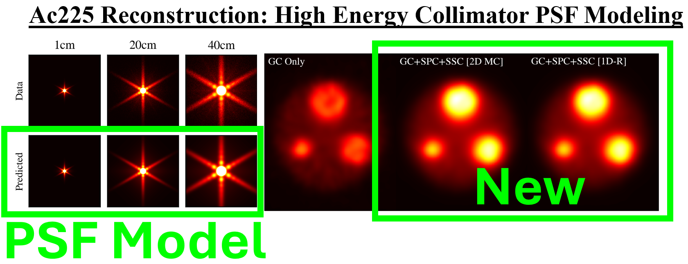

# SPECT Point Spread Function Toolbox

This toolbox provides functionality for developing and fitting PSF models to SPECT point source data; the developed PSF models can be loaded into [PyTomography](https://github.com/qurit/PyTomography) for general PSF modeling.

## Installation

1. Clone this repository and navigate to the directory you cloned into.
2. If using anaconda (recommended) then activate the `conda` environment you want to install the repository in.
3. Use the command `python -m pip install -e .` to install the current `main` branch.

## Usage

See the [documentation](https://spectpsftoolbox.readthedocs.io/en/latest/) and in particular the associated [tutorials](https://spectpsftoolbox.readthedocs.io/en/latest/tutorials/tutorials.html) for demonstration on how to use the library.

## Contributing

If you wish to contribute, please see follow the [contributing guidelines](CONTRIBUTING.md) file. Contributions might include fixing bugs highlighted in the [issues](https://github.com/PyTomography/SPECTPSFToolbox/issues), as well as adding new features, such as new operators that accelerate the computational time of PSF modeling.

## License

The package is distributing under the MIT license. More details can be found in the [LICENSE](LICENSE).

## Testing

There is an automated testing script to test the functionality of the library in the [tests](/tests) folder. It requires the `pytest` package is ran using `pytest test_functionality.py`. 

## Context

Gamma cameras used in SPECT imaging have finite resolution: infinitesmal point sources of radioactivity show up as finite "point spread functions" (PSF) on the camera. Sample PSFs from point sources at various distances from a camera can be seen on the left hand side of the figure below.

 The PSF consists of three main components: (i) the geometric component (GC) which depends on the shape and spacing of the collimator bores, (ii) the septal penetration component (SPC) which results from photons that travel through the collimator material without being attenuated, and (iii) the septal scatter component (SSC), which consists of photons that scatter within the collimator material and subsequently get detected in the scintillator. When the thickness of the SPECT collimator is large and the diameter of the collimator bores is small relative to the energy of the detected radiation, the PSF is dominated by the GC and can be reasonably approximated using a distance dependent Gaussian function. When the energy of the photons is large relative to the collimator parameters, the PSF contains significant contributions from SPC and SSC and it can no longer be approximated using simple Gaussian functions. The tails and dim background present in the PSF plots in the figure below correspond to the SPC and SSC. For more information, see [chapter 16 of the greatest book of all time](https://www.wiley.com/en-in/Foundations+of+Image+Science-p-9780471153009)

 The figure below shows axial slices of reconstructed Monte Carlo Ac225 SPECT data. The images highlighted as "PSF Model" correspond to application of a PSF operator developed in the library on a point source. The images highlighted as "New" are obtainable via reconstruction with [PyTomography](https://github.com/qurit/PyTomography) using the PSF operators obtained in this library; they require comprehensive PSF modeling. 

 

